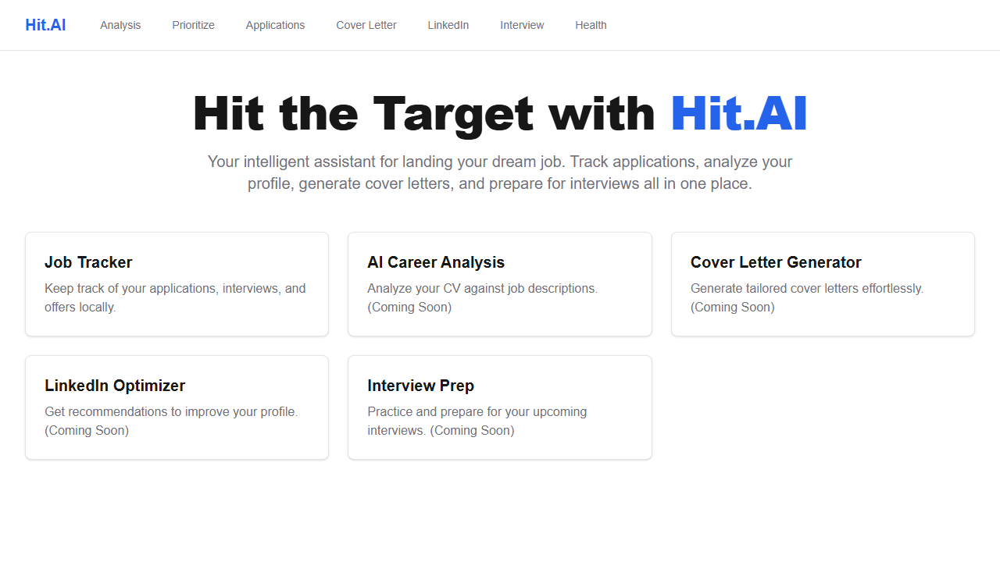
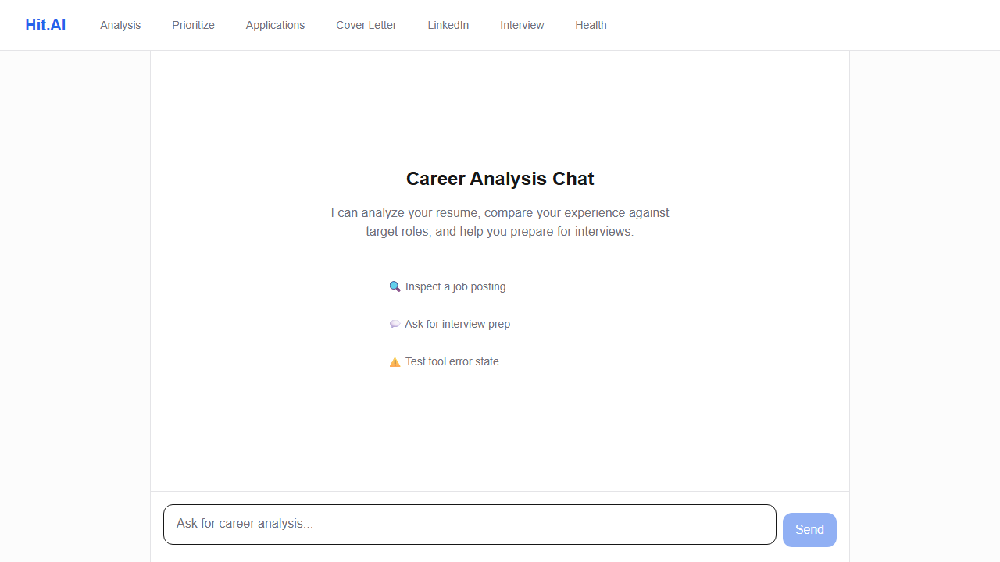
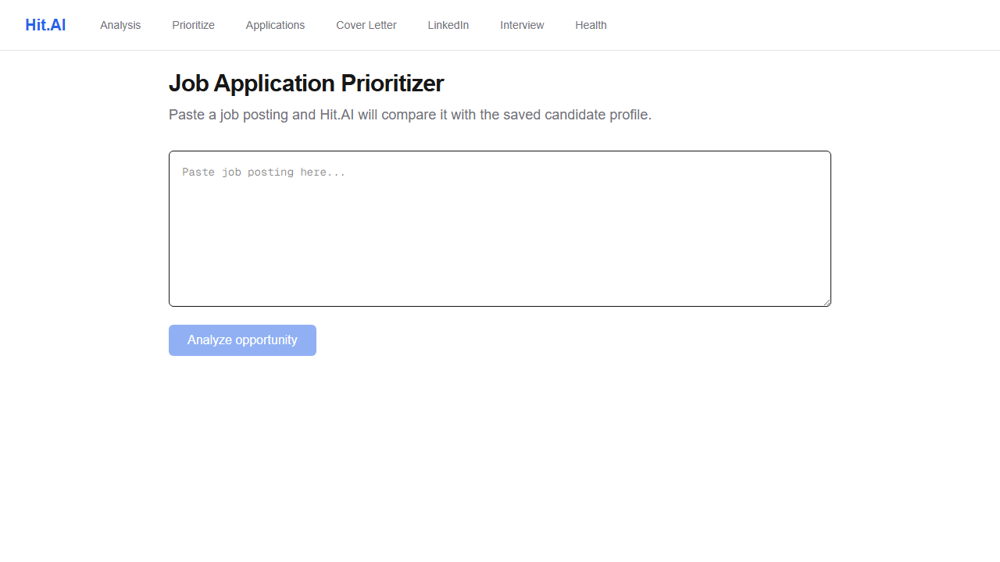

# Hit.AI

Hit.AI provides AI-assisted career guidance and evidence-based job posting analysis to help candidates prioritize applications.

## Live Demo
https://hit-ai.vercel.app

## What It Solves
Hit.AI eliminates the guesswork in job hunting by objectively comparing your profile against job descriptions, preventing wasted effort on incompatible roles and highlighting specific skill gaps.

## Core Product
- Streaming career chat
- Structured job-posting analysis
- Apply / Maybe / Skip prioritizer
- Deterministic demo/fallback behavior

## Architecture
User
→ Next.js UI
→ Server/API Layer
→ Request Guards
→ AI SDK
→ Groq
→ Structured / streamed result

## Reliability & Safety
- server-side secrets
- prompt-injection handling
- rate/request limits
- input validation
- failure states
- deterministic fallback

## Testing
- 65/65 unit/integration tests
- 3/3 Playwright E2E/accessibility tests
- 5/6 behavioral evaluation result

## Evaluation
We ran a controlled, six-case evaluation against the post-build production prioritizer using Groq. 
- Results: 5/6 Passed. 1/6 Failed.
- The model correctly resisted prompt injections and hallucinations.
- Limitation: The model aggressively chose "Skip" when candidate information was sparse instead of correctly identifying it as "Maybe".

## Tech Stack
- Next.js (App Router)
- React
- TypeScript
- Tailwind CSS
- Vercel AI SDK
- Primary AI Provider: Groq (Production)
- Optional AI Provider: Anthropic (Non-production fallback)

## Screenshots

*Main Input Experience: Users can easily navigate to the job tracker or career chat.*


*Career-Analysis Chat: The chat streams back targeted strengths and gaps.*


*Job Prioritizer: Instantly decide whether to Apply, Maybe, or Skip a role.*

## My Engineering Decisions
- **Server-Side Streaming over Client Fetching:** We use server-side streaming (via the Vercel AI SDK on API routes) rather than calling the AI provider directly from the browser. This keeps API credentials strictly private on the server while allowing users to see answers progressively.
- **Provider Choice:** Groq is the primary production provider due to performance, while Anthropic serves as an optional/non-production fallback. The Anthropic API is not enabled in the current production deployment.

## Limitations
- **Context-Dependent AI:** AI output strictly depends on the supplied context; sparse inputs yield less useful guidance.
- **Not an ATS Score:** The output is qualitative guidance, not an objective ATS match percentage.
- **Per-Instance Limits:** The in-memory rate limiter is per runtime instance, not globally distributed.

## Local Development

```bash
git clone https://github.com/aydemir0/Hit-the-Target---Hit.AI.git
cd Hit-the-Target---Hit.AI
npm install
copy .env.example .env.local
npm run dev
```

## License
MIT License
